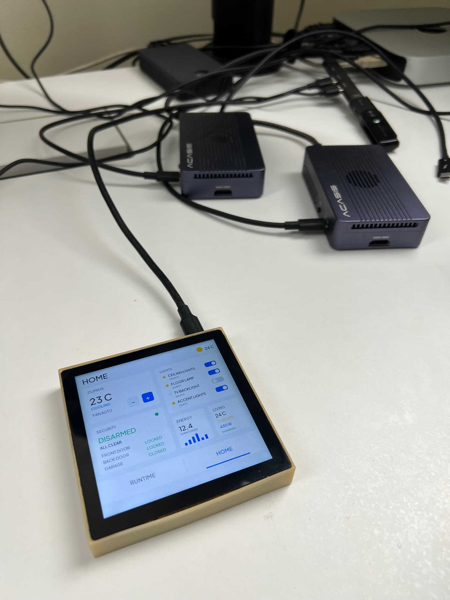
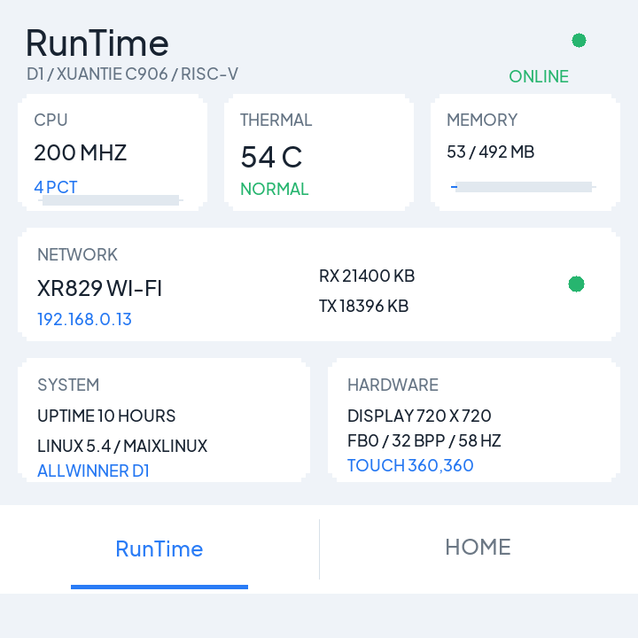
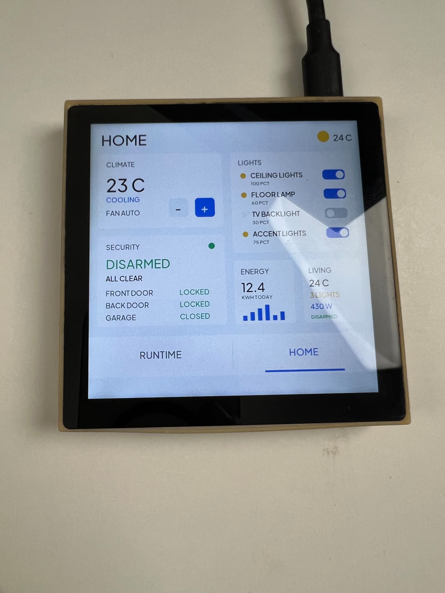

# Allwinner D1 OS Benchmark and RunTime Panel

RunTime Panel began as a controlled experiment: run Linux, RT-Thread RT-Smart, and Apache NuttX on exactly the same Allwinner D1 RISC-V hardware and measure what changes with each operating-system architecture. It grew into a complete board bring-up, benchmark investigation, and native 720 x 720 touchscreen application with working display, touch, and XR829 Wi-Fi.



**Author:** [Lance Harvie](https://www.linkedin.com/in/lanceharvie/)

## DOIs

- **Software release:** [10.5281/zenodo.22054828](https://doi.org/10.5281/zenodo.22054828)
- **Engineering report:** [10.5281/zenodo.22054539](https://doi.org/10.5281/zenodo.22054539)

## What this project is

This is a same-board, three-OS engineering experiment:

- **Linux** provides a mature, protected-process baseline.
- **RT-Thread RT-Smart** provides an embedded RTOS with MMU-backed userspace and process isolation.
- **Apache NuttX** was evaluated in a lightweight FLAT S-mode configuration.

The objective was not to declare a universal winner. It was to expose how protection, process semantics, scheduler design, timer implementation, ecosystem, and instrumentation affect both benchmark numbers and bring-up effort.

The repository is also the home of the lightweight RunTime panel application developed after the OS work. It renders directly to the framebuffer, reads the touchscreen through Linux evdev, and does not require a browser, desktop environment, or dynamic runtime libraries.

## Watch the experiment

[](https://youtu.be/0gDMiJOwFoE)

> A walkthrough of why I ran the experiment, the Allwinner D1 hardware, Linux, RT-Smart and NuttX bring-up, the watchdog and timer issues encountered, and the resulting benchmark work.

## Hardware

| Component | Configuration |
|---|---|
| Board | [Sipeed Lichee RV / 86 Panel](https://wiki.sipeed.com/hardware/en/lichee/RV/86_panel.html) |
| SoC | Allwinner D1 / `sun20i-d1` |
| CPU | Single-core T-Head / XuanTie C906, RV64 RISC-V |
| Maximum tested benchmark frequency | Approximately 1.008 GHz |
| Memory | 512 MiB DDR3 |
| Display | 720 x 720 LCD, approximately 58.1 fps |
| Input | Capacitive touchscreen |
| Network | XRadio XR829 Wi-Fi |
| Boot media | microSD |
| Architectural timebase | 24 MHz RISC-V TIME counter |

## Operating systems

### Linux

Ubuntu Linux 24.04 was used as the mature protected-process baseline during benchmarking. It supplied full kernel/userspace separation, established process semantics, a broad POSIX environment, and the richest software ecosystem of the three systems.

### RT-Smart

[RT-Thread RT-Smart](https://github.com/RT-Thread/rt-thread) 5.0.2 provided MMU-backed userspace and process isolation in a substantially smaller embedded environment. The D1 bring-up work is documented in [RT-Thread/rt-thread#11714](https://github.com/RT-Thread/rt-thread/pull/11714), including startup, MMU, heap, UART, SDMMC, ROMFS, and watchdog/reset ownership fixes.

### Apache NuttX

[Apache NuttX](https://nuttx.apache.org/) 13.0.1-RC0 was brought up through a local D1 board port in **FLAT S-mode**. The benchmarked configuration used one shared supervisor-mode address space and **did not provide process isolation**. Its results therefore measure a materially different protection model and must not be interpreted as Linux-like protected-process costs.

## Headline benchmark results

These retained results came from the same physical D1/C906 platform:

| Benchmark | Linux | RT-Smart 5.0.2 | NuttX 13.0.1-RC0 FLAT |
|---|---:|---:|---:|
| `clock_gettime` | 121.28 ns | approximately 10.7 us | 51.606 ns |
| Contended mutex, p50 | 21.666 us | 6.833 us | 1.042 us |
| Semaphore handoff, p50 | 21.208 us | 13.250 us | 1.167 us |
| `pthread_create`, p50 | 265.333 us | 1063.958 us | 10.000 us |

The table compares observed behavior, not equivalent OS services. Linux and RT-Smart paid for protected execution and process semantics; the benchmarked NuttX build did not. The full report describes the methodology, comparability limits, retained failures, and measurement validation.

## Real-time latency

The strongest NuttX loaded 1 ms periodic wake-up result was:

| Percentile / outcome | Result |
|---|---:|
| p50 | 0.542 us |
| p99 | 0.583 us |
| p99.9 | 0.708 us |
| Maximum | 0.708 us |
| Missed periods | 0 / 20,000 |

Test conditions were NuttX FLAT S-mode on the single C906 core, fixed-priority scheduling, a periodic FIFO120 task, and a continuous lower-priority FIFO90 compute worker.

The phase-alignment midpoint uncertainty was approximately **+/-0.375 us**. The defensible conclusion is therefore **sub-microsecond wake-up behavior at the measurement floor with extremely tight tails**. It is not evidence that physical scheduler latency was measured to exactly 0.542 us.

### Linux loaded result

Linux `SCHED_FIFO` 80 under load produced:

| Percentile / outcome | Result |
|---|---:|
| p50 | 64.09 us |
| p99 | 76.51 us |
| p99.9 | 94.22 us |
| Maximum | 228.72 us |
| Missed periods | 0 |

Ordinary CFS under load missed 6.42% of periods. This is not a claim that NuttX is universally faster than Linux: Linux supplies a much richer protected execution environment, mature process semantics, and substantially broader hardware and software support.

The frozen RT-Smart 100 Hz configuration could not represent a valid 1 ms periodic latency test, so no RT-Smart result is presented for that comparison.

## The engineering problems were more interesting than the benchmark

### Inherited watchdog

U-Boot left the Allwinner D1 watchdog running with an approximately 16-second timeout. NuttX initially reached `nsh>` successfully and then reset. The durable fix was to disable the inherited watchdog early in board initialization.

### SBI TIME failure

[OpenSBI](https://github.com/riscv-software-src/opensbi) advertised the SBI TIME extension and `set_timer` returned success, but supervisor timer pending was never delivered through STIP on the tested platform/firmware path. NuttX was moved to the native Allwinner D1 Timer1 peripheral instead.

### Timer off-by-one

The first Timer1 interval value, **24,000**, produced an effective **24,001-clock** period. With a 24 MHz input clock, that one-count error introduced approximately 41.7 ppm of error and accumulated to about **0.84 ms over roughly 20 seconds**.

Programming **23,999** produced the intended 24,000 input clocks per scheduler tick and removed the accumulated drift. This small register-semantic error was large enough to invalidate a sub-microsecond latency conclusion.

### Measurement perturbation

UART diagnostic output at 115200 baud measurably disturbed the latency experiment and produced millisecond-scale apparent clock drift. The final measurement interval therefore ran silently. Instrumentation was part of the system under test, not a free observation channel.

## From benchmark board to working touchscreen

The engineering work continued after the benchmark. The Tina/MaixLinux board now has:

- reliable SD boot;
- a stable 720 x 720 LCD at approximately 58.1 fps;
- the correct `default_lcd` panel profile;
- validated framebuffer black, white, red, green, and blue output;
- PWM7 backlight at 20 kHz;
- a working `fts_ts` capacitive touchscreen with live X/Y events;
- working XR829 Wi-Fi; and
- IP networking, DNS, and Internet connectivity.

No network credentials are stored in this repository.

## RunTime interface

The native RunTime dashboard reports live CPU frequency/load, thermal state, memory, uptime, Linux status, XR829 network activity, IP address, display details, and touch coordinates. It uses a RAM back buffer and event-driven redraws to keep the single-core D1 responsive.



### RunTime Panel video

[](https://youtu.be/ES-3FGEeBE4)

> Demonstration of the working 720 x 720 LCD, capacitive touch input, live RunTime system dashboard, and the Home smart-home style interface.

## Home interface

The Home screen is a local smart-home UI demonstration. It does **not** require or claim a connection to a Home Assistant server. It demonstrates climate controls, light toggles, security state, energy visualization, living-room status, and touch navigation. The bottom bar switches instantly between **RunTime** and **Home**.



## Why this matters

Embedded OS selection is not a one-dimensional speed contest. The practical tradeoff includes:

- protection and failure containment;
- process and userspace semantics;
- scheduler determinism;
- memory footprint;
- ecosystem and hardware support;
- implementation maturity; and
- bring-up and maintenance complexity.

The experiment also demonstrates that inherited bootloader state, timer-register semantics, interrupt delivery, and benchmark instrumentation can change a result by orders of magnitude. Those details must be validated before architectural conclusions are drawn.

## Repository contents

| Path | Contents |
|---|---|
| `src/main.c` | Freestanding direct-framebuffer UI, system metrics, evdev input, and idle backlight control |
| `src/font_atlas.h` | Generated antialiased font atlas used by the panel application |
| `tools/generate_font.py` | Deterministic atlas generator |
| `Makefile` | Static RV64 cross-build |
| `docs/Allwinner_D1_OS_Bringup_Benchmark_Report.pdf` | Full engineering report |
| `docs/images/` | Curated, web-sized project images |
| `docs/releases/v1.0.0.md` | Draft v1.0.0 release notes |
| `LICENSE` | MIT license for repository source where applicable |
| `FONT-LICENSE.txt` | Bundled font license |

This repository contains the RunTime panel application and the consolidated engineering report. It does **not** claim to contain every Linux, RT-Smart, or NuttX source tree, every intermediate firmware image, or every benchmark binary used during the wider investigation.

## Build

The current build is a freestanding, statically linked RISC-V executable. The verified macOS cross-build uses Homebrew's `riscv64-elf-gcc`:

```sh
make
```

This produces:

```text
runtime-panel
```

The generated font atlas is already committed. To regenerate it:

```sh
python3 -m venv .fontenv
.fontenv/bin/pip install Pillow
.fontenv/bin/python tools/generate_font.py
make
```

The generator downloads no files. It expects a local Plus Jakarta Sans TTF path supplied with `FONT_TTF`, or the font path currently documented in the script.

### Run on the panel

Copy the binary to Tina/MaixLinux and run it as root so it can access the framebuffer, evdev node, and DISP2 backlight control:

```sh
cd /root/runtime-panel
./runtime-panel
```

The application:

- detects the active framebuffer geometry, stride, and pixel format;
- discovers the `fts_ts` event node through sysfs rather than assuming `eventX`;
- refreshes RunTime metrics once per second;
- redraws when state changes rather than running a 60 fps loop; and
- blanks after 60 seconds of inactivity and wakes on the next touch.

## Full Engineering Report

[**Download the full Allwinner D1 OS Bring-Up and Benchmark Report (PDF)**](docs/Allwinner_D1_OS_Bringup_Benchmark_Report.pdf)

**Published report:** [10.5281/zenodo.22054539](https://doi.org/10.5281/zenodo.22054539)

The 30-page report contains the full methodology, Linux results, RT-Smart results and limitations, NuttX D1 port creation, watchdog diagnosis, native Timer1 diagnosis, benchmark validation, cross-OS comparisons, limitations, reproducibility information, and the later touchscreen/display/network work.

## Repository and reproducibility status

- Public repository: <https://github.com/lanceharvie/allwinner-d1-os-benchmark>
- Release branch: `main`
- Source is MIT licensed where applicable; the font license remains separately preserved.
- Local credentials, Wi-Fi secrets, generated binaries, raw framebuffer captures, and the local font build environment are excluded.
- The report identifies retained source states, methodology, limitations, and the artifacts needed to reproduce the broader OS work; artifact availability is stated explicitly rather than implied.

## Upstream projects

- [Apache NuttX](https://nuttx.apache.org/)
- [RT-Thread](https://github.com/RT-Thread/rt-thread)
- [Sipeed Lichee RV / 86 Panel](https://wiki.sipeed.com/hardware/en/lichee/RV/86_panel.html)
- [RISC-V OpenSBI](https://github.com/riscv-software-src/opensbi)

## Author

**Lance Harvie**

[LinkedIn](https://www.linkedin.com/in/lanceharvie/)
